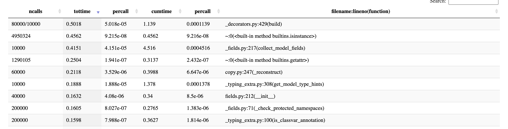
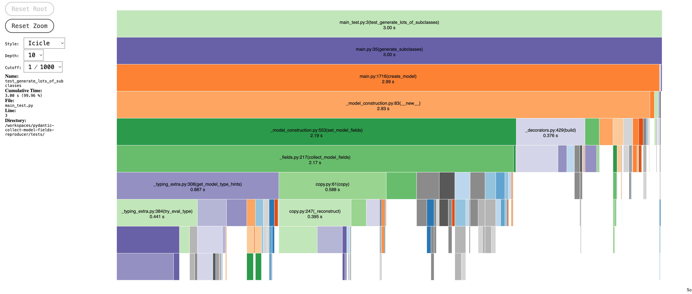

# Pydantic-collect-model-fields-reproducer

## Overview

Simple test to test pydantic subclass construction.

Created for https://github.com/pydantic/pydantic/issues/12647.

## Usage

1. Clone this repo
2. Open folder in VS Code
3. Run below command

```bash
uv run main.py
```

Example output

```text
2026-01-09 00:53:39,945 INFO     Starting generation of 10000 subclasses
2026-01-09 00:53:40,892 INFO     Generated 10000 subclasses
2026-01-09 00:53:40,939 INFO     DynamicModel0.__mro__=(<class '__main__.DynamicModel0'>, <class '__main__.AWSCloudContainer'>, <class '__main__.CloudContainer'>, <class '__main__.Container'>, <class '__main__.Component'>, <class 'pydantic.main.BaseModel'>, <class 'object'>)
2026-01-09 00:53:40,939 INFO     DynamicModel0.__bases__=(<class '__main__.AWSCloudContainer'>,)
```

## Profiling

```bash
uv run pytest --profile
uv run snakeviz prof/combined.prof
```





## Analysis

From the profile you can see get_model_type_hints being high because it is looping across `obj.__mro__` which tries to eval every annotation for every base class.

This is not necessary though because `collect_model_fields` already has `parent_fields_lookup` which contains all the field info already for the parents.

`collect_model_fields` should:

1. get parent_fields_lookup which it already does
2. get the annotations just for obj.__mro__[0] (the class being constructed)
3. combine 1 & 2 to give the final hints
